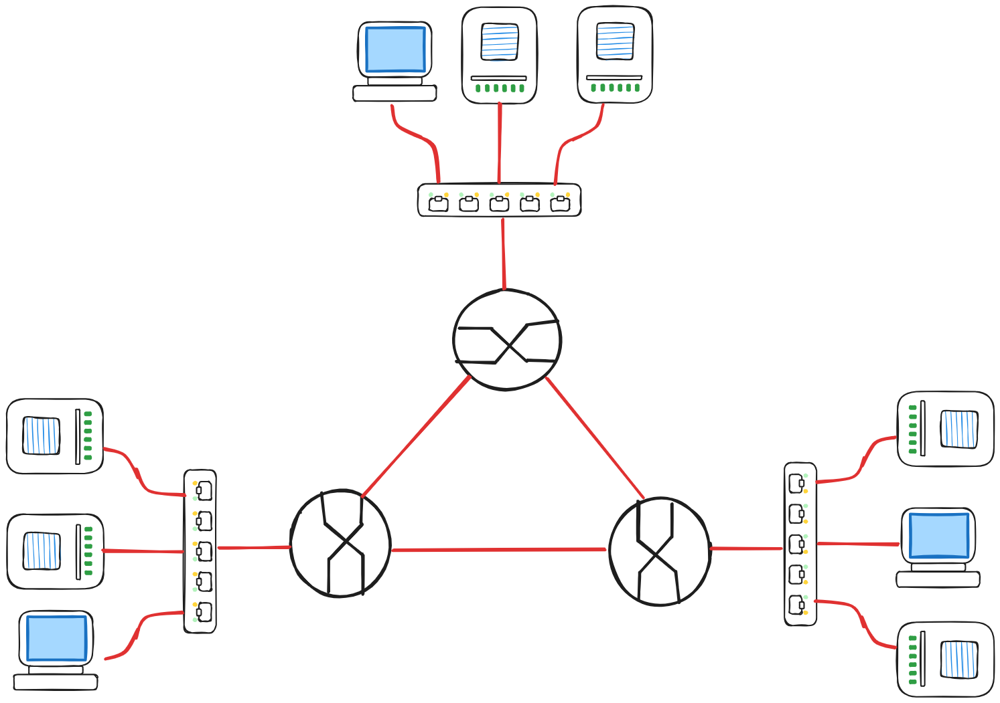

# TechSecure Firewall

A firewall implemented in p4.

This project was developed as a study case for Software Defined Networks course in Universidade do Minho's Computer and Software Engineering Master's degree.

## Installation

Clone the repository:

```bash
  git clone https://github.com/gweebg/sdn-firewall.git
  cd sdn-firewall
```


Install all required packages with `pip`:

```bash
  python -m venv .env
  source .env/bin/activate
  pip install -r requirements.txt
```
    
## Pipeline

Compile the `P4` code:

```bash
  p4c-bm2-ss --p4v 16 src/p4/[file.p4] -o json/[file].json
```

Edit the config file to point to the correct `json`:

```toml
# Router configurations
[[routers]]
name = "r1"
json_path = "json/{code_file}.json"
thrift_port = 9090
(...)
```

Run the mininet topology:
```bash
  sudo python topology --config [config_filepath]
```

Define the switches flows with `action=normal` since we don't have a network controller:

```bash
  sh ovs-ofctl add-flow {switch} action=normal
```

Create the `commands/{router}.txt` for each router and upload them via their respective thrift servers:

```bash
  simple_switch_CLI --thrift-port [thrift_port] < src/p4/commands/{router}.txt
```

Test the topology by pinging the hosts:
ff
```bash
  h1 ping h2
```

## Topology



## Usage/Examples

Running the program requires `sudo` due to how [Mininet](http://mininet.org/) works.

```bash
  sudo python3 topology --config [config_filepath]
```

Config file `config/network.toml` layout example

```toml
#Example configuration file for the network

# Network summary
## this section is used to define the network configuration and to validate
## the number of devices initialized in the network
##
## Parameters
### name: the name of the network
### hosts: the number of hosts in the network
### routers: the number of routers in the network
### switches: the number of switches in the network
### links: the number of links in the network
[network]
name = "example-network"
hosts = 2
routers = 2
switches = 1
links = 3

# Common configuration settings
## this section is used to define the common configuration settings for the
## network devices
##
## Parameters
### key: value, used in the devices with the format ${common.key}, supports
###      all toml primitive types
[common]
key = "value"
key2 = 1

# Host configurations
## this section is used to define the host configurations
##
## Parameters
### name: the name of the host
### ip: the ip address of the host
### cls: the class of the host
### mac: the mac address of the host (ETH0)
### default_gw_mac: the mac address of the default gateway
### default_gw_ip: the ip address of the default gateway
### ports: the list of ports of the host (Not used)
### **: any other parameter can be added to the host configuration
[[hosts]]
name = "host1"
ip = "10.0.1.10/24"
cls = "${common.cls_host}"
mac = "00:00:00:00:00:01"
default_gw_mac = "00:00:00:00:00:10"
default_gw_ip = "10.0.1.1"
ports = ["00:00:00:00:00:01"]

# Router configurations
## this section is used to define the router configurations
##
## Parameters
### name: the name of the router
### json_path: the path to the json file that defines the router configuration
### thrift_port: the thrift port of the router
### bvmodel: the bvmodel of the router
### cls: the class of the router
### range: the range of the router (Not used)
### ip_ports: the list of ip addresses of the router
### ports: the list of ports of the router (Not used)
### **: any other parameter can be added to the router configuration
[[routers]]
name = "r1"
json_path = "json/simple-router.json"
thrift_port = 9090
bvmodel = "${common.bvmodel}"
cls = "${common.cls_router}"
range = 5
ip_ports = ["10.0.1.1/24"]
ports = ["00:00:00:01:01:01", "00:00:00:01:01:02"]

# Switch configurations
## this section is used to define the switch configurations
##
## Parameters
### name: the name of the switch
### cls: the class of the switch
### range: the range of the switch (Not used)
### ports: the list of ports of the switch
### **: any other parameter can be added to the switch configuration
[[switches]]
name = "s1"
range = 5
cls = "${common.cls_switch}"
ports = ["00:00:a1:01:01:01", "00:00:a1:02:00:01", "00:00:a1:02:00:02", "00:00:a1:02:00:03"]


# Links between devices
## this section is used to define the links between the devices
##
## Parameters
### device1: the name of the first device
### port1: the port of the first device
### mac1: the mac address of the first device
### device2: the name of the second device
### port2: the port of the second device
### mac2: the mac address of the second device
[[links]]
device1 = "host1"
port1 = 1
mac1 = "00:00:00:00:00:01"
device2 = "r1"
port2 = 1
mac2 = "00:00:00:00:00:10"
```


## Authors

- [@Guilherme Sampaio](https://github.com/gweebg)
- [@Miguel Gomes](https://www.github.com/MayorX500)
- [@Rodrigo Pereira ](https://github.com/eivarin)

## License

[MIT](https://choosealicense.com/licenses/mit/)

